# Lumia 文字 —— Selagrafi（星文 · 星轨体）

Selagrafi 是 Lumia 的书写系统，名称由 `sela`（星）+ `grafi`（书写）而来，中文称「**星文**」。
它是**表意 + 表音混合**：核心词与全部天文词各配一个「星符」，专名、外来语、数字则用「音节符」拼写。

**本版为「星轨体」**：追求一笔成字、字与字可首尾连写，弧线、环、螺旋如天体轨道般流动，
不再有方框，笔画大幅精简。

## 一、设计原则（星轨体）

1. **一笔成字**：每个星符尽量由**一条连续笔画**写成（可另加一个星点作为点缀）。
2. **可连写**：每符有固定「起笔点」（左）与「收笔点」（右），前一字收笔顺势接下一字起笔，词成一整条轨道线。
3. **轨道流线**：笔画是弧、环、螺旋、波、拖尾，如星轨草书。
4. **无框**：不设字框，符号开放、流动。
5. **星点点缀**：在关键处点一个小星点（节点），如星座中的亮星。

## 二、三种子系统

| 子系统 | 用途 | 数量 |
| --- | --- | --- |
| **星符**（表意符） | 核心内容词、全部天文科幻词，一词一符 | ~90 符 |
| **音节符**（表音符） | 拼写专名、外来语、未造符的词 | 80 音节 + n 尾符 |
| **星数**（数字符） | 十进制数词 | 10 符 |

## 三、笔形基元（6 种）

所有星符由这 6 种「一笔笔形」构成，本身即带天文意象：

| 基元 | 名 | 形态 | 义 |
| --- | --- | --- | --- |
| 环 | **oba** | ○ 闭环 | 圆、轨道、循环、行星、完整 |
| 弧 | **aka** | ⌒ 开口弧 | 月、部分、运动、方向 |
| 螺旋 | **gala** | 🌀 | 星系、光、辐射、扩展 |
| 波 | **pusa** | ∿ S 形 | 脉冲、波、节奏、时间 |
| 尾 | **koma** | ↙ 渐细拖尾 | 彗尾、光芒、远方、去 |
| 点 | **mi** | ● 星点 | 星、粒子、单、位置、节点 |

## 四、星符构字法（示例）

| 词 | 一笔构成 | 造型描述 |
| --- | --- | --- |
| `lumia` 光 | 螺旋 + 点 | 自中心一点螺旋向外放射 |
| `sela` 星 | 一笔四芒 | 一条连续曲线收出四个尖（内凹星芒） |
| `sola` 太阳 | 环 + 点 | 一个圆环，中心一颗星点（☉ 天文符号） |
| `luna` 月亮 | 一笔弦月 | 外弧与内弧一笔连成的月牙 |
| `paneta` 行星 | 实心圆盘 + 漫游弧 | 一颗实心圆盘，旁拖一条短弧（漫游者轨迹） |
| `Satuna` 土星 | 实心圆盘 + 宽环带 | 一颗实心圆盘，外环一条**宽环带**（土星标志） |
| `komo` 宇宙 | 大环 + 内三点 | 一个大圆环，内含几颗星点（苍穹藏星） |
| `oba` 轨道 | 椭圆 + 环上点 | 一个椭圆，其上一颗星点（天体） |
| `vaka` 虚空 | 开口环（大缺口） | 一个留了明显缺口、一笔写成的环（空） |
| `pusa` 脉冲 | 单笔 S 波 | 一段连续波形 |
| `kometa` 彗星 | 点 + 单笔拖尾 | 一颗星点，拖一条渐细长尾 |
| `gala` 星系 | 螺旋 | 一条漩涡螺旋 |
| `sema` 时间 | 波 + 点 | 波形上一颗星点（此刻） |
| `tele` 远 | 点 + 长尾 | 一颗星点，一条指向远方的长尾 |
| `nova` 新 | 上箭头 + 星点 | 一支上升箭头，顶端一颗星点（新星升起） |
| `nebula` 星云 | 柔波 + 散点 | 一条柔和雾线，散落几点星（星云/云/雾） |
| `meta` 超越 | 点 + 上抛弧 | 一颗点，抛出一道越过头顶的弧（超越/之后） |
| `miko` 小 | 内收双弧 | 两个向内收拢的短弧（缩小） |
| `mako` 大 | 外张双弧 | 两个向外张开的短弧（放大） |
| `enega` 能量 | 锯齿折线 | 一道尖锐折线（能量/力） |
| `era` 大气 | 柔弧 | 一条平缓柔弧（空气/大气） |

> `vaka`（虚空）已从「虚线多段」改为**单笔开口环**——一笔留隙，既简又空。

## 五、连写规则

- **起笔**：每符从**左侧基准线**起笔；**收笔**：落在**右侧基准线**。
- 书写一个词时，前符收笔不断开，顺势续写后符起笔，一词一轨。
- 断笔只发生在：换词（空格）、换行、加星点点缀。

## 六、音节符（表音，已定稿）

- 音节 = 辅音 × 元音：**16 辅音 × 5 元音 = 80 个音节符**，另有 1 个 `-n` 尾符。
- 构字法：**辅音决定主体笔画形状，元音决定定位点位置**。

| 元音 | 定位点位置 |
| --- | --- |
| a | 上方 |
| e | 左方 |
| i | 下方 |
| o | 右方 |
| u | 中央（无点） |

- `-n` 尾：在音节符右下加一短勾（⌐）。
- 音节符同样遵循一笔、可连写。

**书写模式**（类似日语的汉字 + 假名）：

1. **纯星符**：实义词一词一符，逐词表意。
2. **纯音节符**：所有词按读音逐音节拼写（如假名）。
3. **混合**：实义词/天文词用星符，专名、外来语、语法小词用音节符。

## 七、星数（数字符）

- **0** = 开口环 ◌（虚空 vaka）
- **1** = 环中一点 ☉（太阳 sola）
- **2–9** = 2 至 9 颗星点，按 3×3 布局
- 多位数按**位值横排**：如 `2025`＝`2 · 0 · 2 · 5`
- 大数口语用复合，不新造词：`10000 = deka kilo`

数字符标准见 `数字符表.svg`。

## 八、书写方向

- **横写左→右**为默认（便于与拉丁/中文混排）。
- **星座式排布**（艺术模式）：词与词用细线连成星座，适合会徽、海报、星图。

---

## 九、SVG 示例（星轨体）

`字形示例/` 目录内提供以下星符矢量图（均已改为一笔/少量笔画）：

| 文件 | 词 | 义 |
| --- | --- | --- |
| `lumia.svg` | lumia | 光 |
| `sela.svg` | sela | 星 |
| `sola.svg` | sola | 太阳 |
| `luna.svg` | luna | 月亮 |
| `paneta.svg` | paneta | 行星 |
| `satuna.svg` | Satuna | 土星 |
| `komo.svg` | komo | 宇宙 |
| `oba.svg` | oba | 轨道 |
| `vaka.svg` | vaka | 虚空 |
| `pusa.svg` | pusa | 脉冲 |
| `kometa.svg` | kometa | 彗星 |
| `gala.svg` | gala | 星系 |
| `sema.svg` | sema | 时间 |
| `tele.svg` | tele | 远 |

另附系统化图表（下方直接内嵌显示）：

**符表 · 六基元与星符总表**

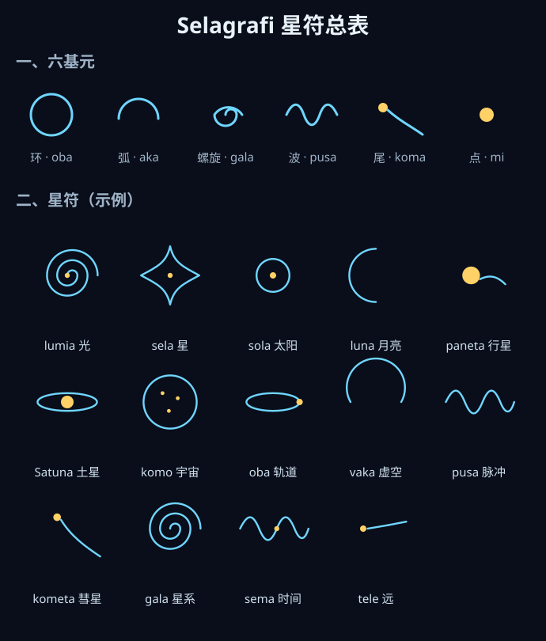

**天文·科幻借词符表**

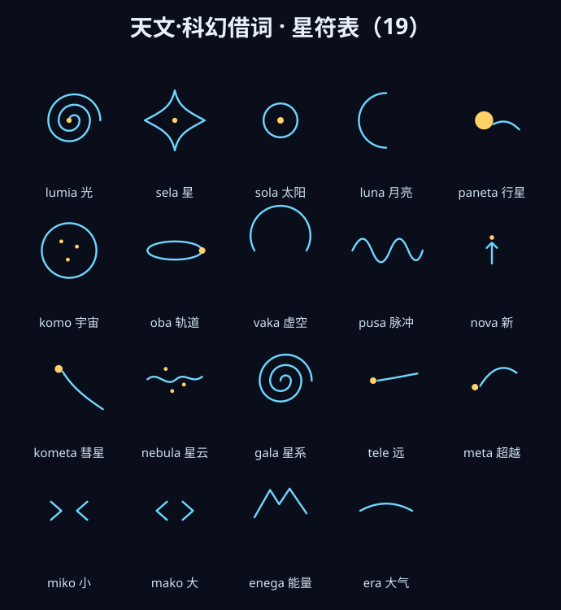

**功能词符表**

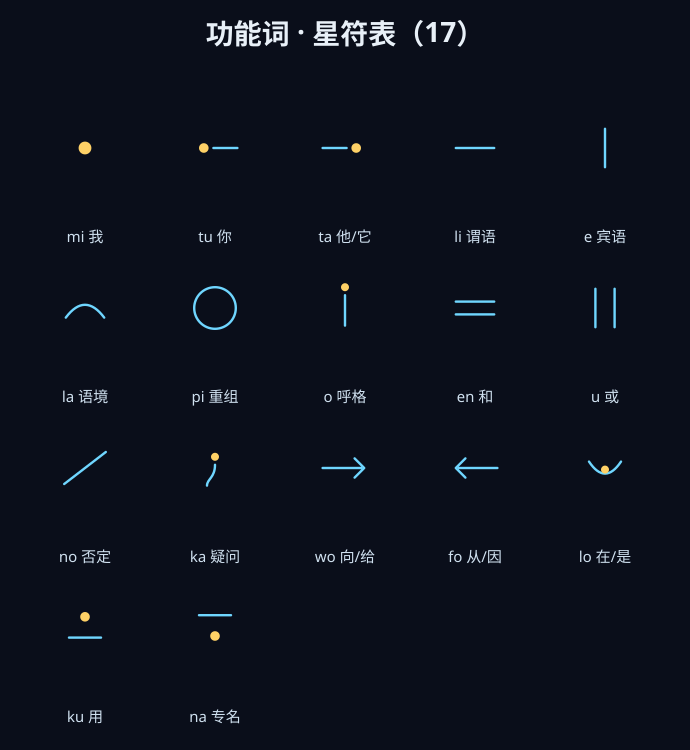

**基础词符表**

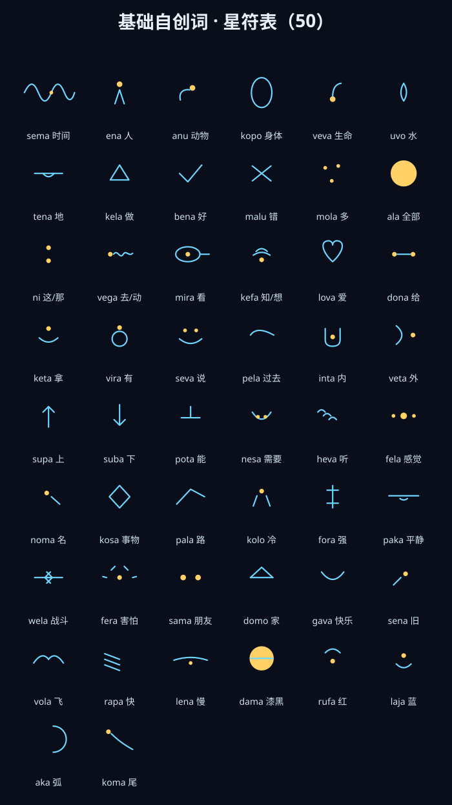

**星数 · 数字符号表**

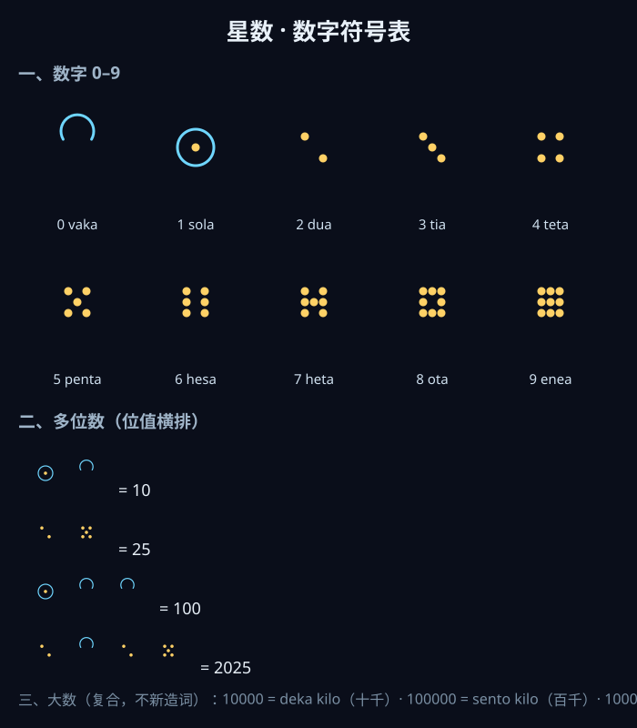

**音节表 · 16×5 完整表**

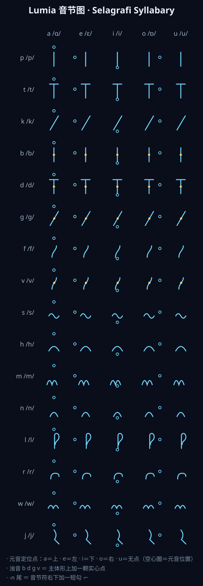

### 单字示例

| lumia 光 | sela 星 | sola 太阳 | luna 月亮 |
| --- | --- | --- | --- |
| 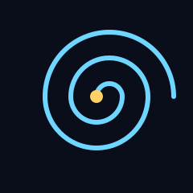 |  | 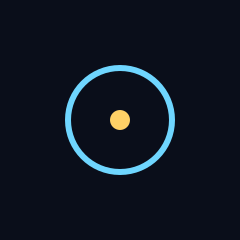 | 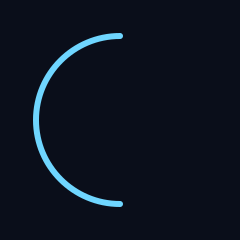 |
| **paneta 行星** | **Satuna 土星** | **komo 宇宙** | **oba 轨道** |
|  |  | 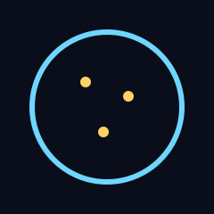 |  |
| **vaka 虚空** | **pusa 脉冲** | **kometa 彗星** | **gala 星系** |
| 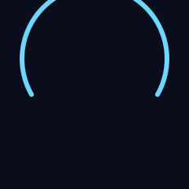 | 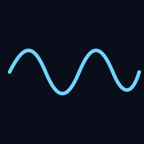 | 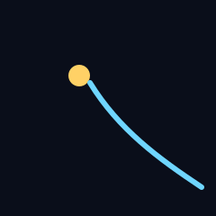 | 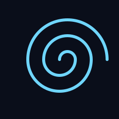 |
| **sema 时间** | **tele 远** | **nova 新** | **nebula 星云** |
| 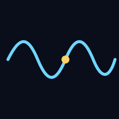 | 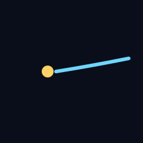 |  |  |
| **meta 超越** | **miko 小** | **mako 大** | **enega 能量** |
|  |  |  |  |
| **era 大气** | | | |
|  | | | |

---

## 十、星座式排布（星座体）

除「星轨体」的逐词横写外，本文字系统另有一套**艺术排布规范**——把一句话摆成一个**星座**：

- 📄 **[星座体规范.md](星座体规范.md)** —— 完整规则：层级 / 节点 / 句轨 / 标点 / 句间连接 / 内角目标 / 空间分配
- 🖼️ **[星座体示例.svg](星座体示例.svg)** —— 三句连排示范（闭合三角形 + 弧轨 + 星位光晕 + 图例）
- 🖼️ **[星座体特色示例.svg](星座体特色示例.svg)** —— **天体隐喻时态**：同一句话的三种时间
- 🖼️ **[星座体数字与音节示例.svg](星座体数字与音节示例.svg)** —— 数字符与音节符串在星座体中的排布
- 🖼️ [星座示例.svg](星座示例.svg) —— 早期横版原型，仅作风格参考

### 核心规则（速览）

| 层级 | 文本 | 图形 |
| --- | --- | --- |
| 星 | 词 | 节点（主星 0.42 / 伴星 0.27） |
| **星座** | **句** | **一条句轨连成的图形** |
| 星系 | 段 | 句间以**弧轨**弱连 |

1. **一句话 = 一个星座。**
2. **星位光晕**：每个节点外加一圈极淡圆环（主星 r=26 / 伴星 r=17），标记「此处是一颗星」——
   否则 `li`（短横）、`e`（短竖）等伴星的**字形本身就是线段**，会与句轨混淆。
3. **句轨在光晕边缘断开**，不穿过星符。这是「星座」与「折线图」最直接的分界。
4. **短句闭合**（≤ 4 词）：首尾相连收成封闭图形，对应句号；长句保持开放。
5. **内角目标 50–90°**：锐角来自段与段之间的**方向突变**，不是把图拉方。
6. **要成「臂」，不要成「锯齿」**：连续 2–3 个节点同向推进构成一条臂，而非每词反向一次。
7. **空间按词数分配**：不给每块平均分，目标是**每节点的平均占地面积大致相等**。
8. **数词的双重身份**：**实义**（作主语/宾语）⇒ 主干节点；**数值义**（修饰名词）⇒ **卫星**，
   以「较浅的连线」挂在名词旁侧，形如地球与月球。
   专名用**音节符串**拼写，向外延伸成「双体 / 多体」。二者都不参与句轨主路径。
   统一公式：**光晕半径 = cell / 2 + 1**。

> **与星轨体的分工**：星轨体用于日常书写与文档；星座体用于会徽、海报、Slogan、星图等展示场合。
> 二者**共用同一套星符**，只是排布规则不同。

> **在线查看**：[星座体示例](https://wanziyi233.github.io/lumia-conlang/文字/星座体示例.svg) · [特色示例（时态）](https://wanziyi233.github.io/lumia-conlang/文字/星座体特色示例.svg) · [数字与音节示例](https://wanziyi233.github.io/lumia-conlang/文字/星座体数字与音节示例.svg)
